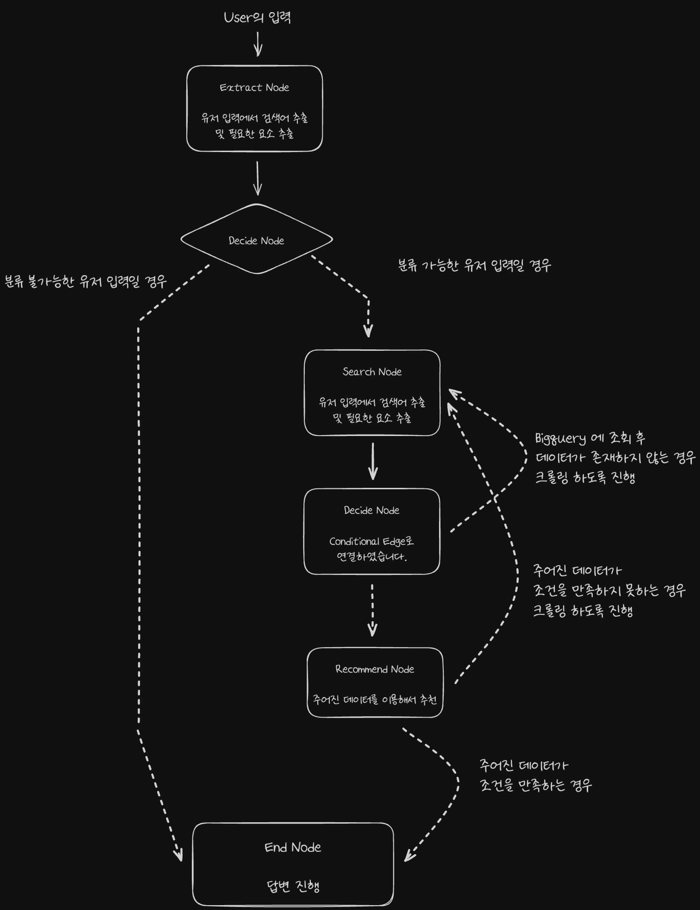
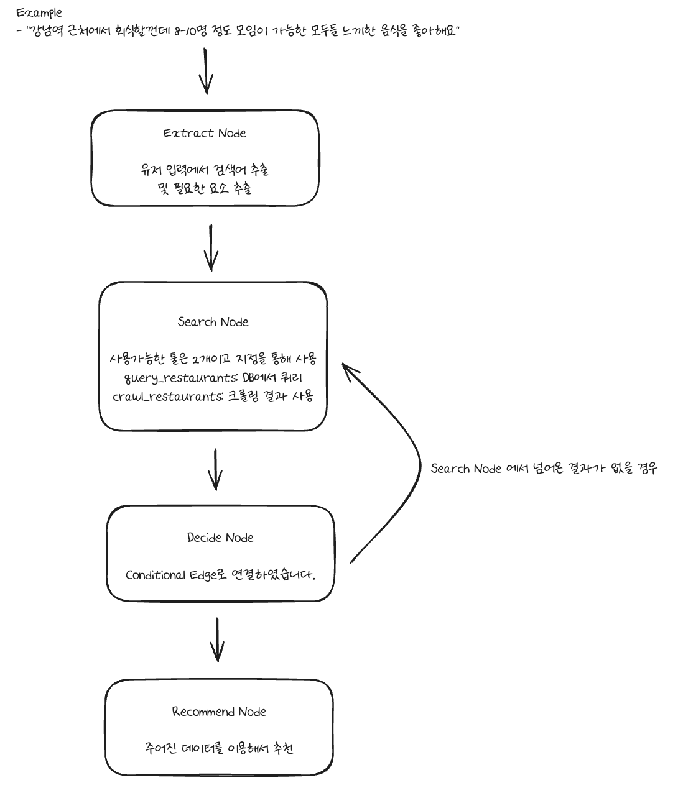

# Langgraph

## 2024-06-06

## 동작

### 강남역 일식

[LangSmith](https://smith.langchain.com/public/9f41de33-ba73-4a5e-8df9-88aa72f8e858/r)

- 현재 쿼리가 가능한 단어이기 때문에 bigquery에 쿼리해서 결과로 리뷰결과를 추천해줍니다.

### 강남역 일식 네이버 예약 가능해야해

[LangSmith](https://smith.langchain.com/public/b429e94e-7b4f-40cf-baf1-9de992eb8aa5/r)

- 쿼리가 가능한 단어이지만 유저의 요구조건이 `네이버 예약 가능` 이기때문에 다시 돌아가 크롤링을 진행합니다.

### 이상한 입력

[LangSmith](https://smith.langchain.com/public/13eabf03-ccd5-49b8-9334-78e2a8479be5/r)

- 분류불가한 입력에 대해 `잘 이해하지 못했어요. 다시 말씀해주세요.` 로 응답합니다.

## 2024-05-15

[LangSmith](https://smith.langchain.com/public/22005f26-0bcd-4da3-9c4e-191ddf33c12d/r)
1. 검색어를 추출합니다.
2. Search Node에서는 처음 시도에서는 query_restaurants 를 이용하여 검색합니다.
3. Decide Node에서는 결과가 없을경우 Search Node로 돌아가 crwal_restaurants 를 이용합니다.
4. 최종적으로 Recommend Node에서 데이터를 바탕으로 유저에게 맛집을 추천합니다.

## 2024-05-01

- `python test.py` 실행으로 input을 통해 검색어를 추출하고 검색을 진행하여 음식점 이름으로만 추천을 진행합니다.

## 크롤링 구조

1. 공용의 Redis 존재
2. 검색어에 따라 레스토랑 목록을 크롤링 해서 Redis에 저장
3. Redis의 데이터를 각자의 VM에서 하나씩 가져와서 처리 후 공용 Storage 혹은 DB에 저장

## 동시성제어 테스트

https://github.com/ehddnr301/crawling_example/assets/54092915/326bcdb0-09d2-47c7-8017-c98ed848a874
